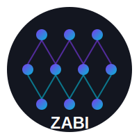

<p align="center">
  
</p>

<h1 align="center">Zabi Network</h1>
<p align="center">AI image recognition platform built with PyTorch</p>

---

## Quick Start

### Install dependencies

```bash
python3 -m venv venv
source venv/bin/activate  # On Windows: venv\Scripts\activate
pip install torch numpy matplotlib pyyaml flask Pillow
```

### Run the web app

```bash
python app.py
```

Open http://127.0.0.1:5000 in your browser.

### Train a model

1. Upload images by class (e.g., "dogs", "cats") using the dataset section
2. Adjust training settings if needed
3. Click "Start Training"
4. Watch live metrics update in real-time
5. After training, upload any image to the Predict section to classify it

---

## Main Files

These are the 4 files you'll use most:

| File | What it does |
|------|-------------|
| **app.py** | Web server - runs the dashboard |
| **model.py** | The neural network (CNN + RNN + Transformer) |
| **data.py** | Loads your images for training |
| **config.yaml** | Change settings like learning rate, batch size, etc |

The other files handle specific stuff like training loops, metrics, and custom layers. You usually don't need to touch them.

---

## Features

- Hybrid CNN + RNN + Transformer architecture
- Real-time training dashboard with live charts
- Drag-and-drop image upload for custom datasets
- Instant image prediction after training
- Configurable hyperparameters (learning rate, optimizer, batch size, etc.)
- Supports both synthetic and real image data

## Quick Start

### Install dependencies

```bash
python3 -m venv venv
source venv/bin/activate  # On Windows: venv\Scripts\activate
pip install torch numpy matplotlib pyyaml flask Pillow
```

### Run the web app

```bash
python app.py
```

Open http://127.0.0.1:5000 in your browser.

### Train a model

1. Upload images by class (e.g., "dogs", "cats") using the dataset section
2. Adjust training settings if needed
3. Click "Start Training"
4. Watch live metrics update in real-time
5. After training, upload any image to the Predict section to classify it

## Architecture

The model combines three types of neural networks:

1. **CNN** - Extracts visual features from images
2. **Bidirectional LSTM** - Processes features as sequences
3. **Transformer** - Applies self-attention with gating mechanisms

All core components (layer normalization, dropout, multi-head attention) are implemented from scratch without relying on high-level PyTorch modules.

## Training Options

You can train on:
- **Your own images** - Upload through the web interface or point to a folder
- **Synthetic data** - Random generated data for testing (default)

## CLI Usage

```bash
# Train from command line
python main.py --mode train --config config.yaml

# Evaluate a trained model
python main.py --mode eval --resume ./checkpoints/best_model.pt

# Profile model performance
python main.py --mode profile

# Neural architecture search
python main.py --mode nas
```

## Requirements

- Python 3.9+
- PyTorch
- Flask
- Pillow
- NumPy
- Matplotlib
- PyYAML

